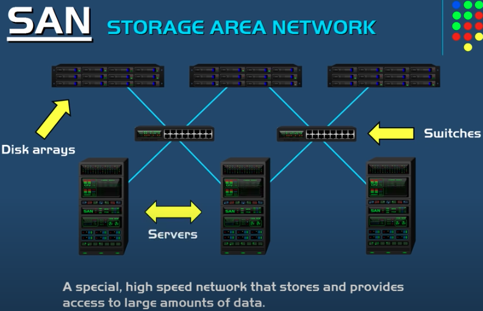

## NAS (Network Attaches Storage)

- Has a network card directly attaches to a switch or router on a network
- It can be accesible from anywhere to use as a shared drive
- Used in homes and small to medium-size businesses
- The main disadvantages of the NAS is SPOF. For ex: if the power supplies fail then it is not accessible. (`search: Probably there are ways to run NAS in HA mode, research it`)

## SAN (Storage Area Network)

- A special, high speed network that stores and provides access to large amounts of data
- Dedicated network consists multiple, disk arrays, switches and servers (`search: what is disk array?à) 
- SANs are fault tolerant
- Data is shared among several disk arrays
- When servers access this data as if it was a local hard drive. Because thats how operating system recognize SAN (`search: Why is that? `)
- Highly scalable
- High speed because devices interconnected using fibre channel. Fibre channel is fiber optics. Speeds between 2Gbit/s - 128 Gbit/s, it is extremely fast
- Some SAN uses iSCSI instead of fibre channel. Because it is cheaper. It is a cheaper alternative to using fibre channel, but not as fast as it.
- SANs are not affected by network traffic, such as bottlenecks in a local area network. This is because SANs arent really a part of local area network, it is partitioned off.
It is basically a network all by itself
- SANs are expensive

## Things to Search
- iSCSI, NFS etc.
- Disk Array
- HA in NAS
- Files vs block storage access in both of them