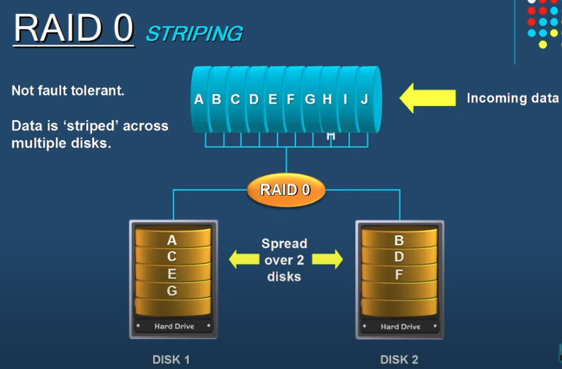
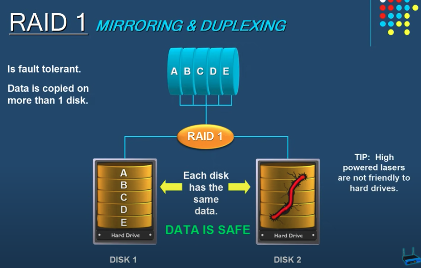

- Redundant copy of disk, prevents data loss
- Types of RAIDs are `RAID0`, `RAID1`, `RAID5`, `RAID10`

## RAID 0 (Striping)

- Not fault tolerant
- Data is sptriped across multiple disks
- Advantage is speed

## RAID 1 (Mirroring & Duplexing)

- Is fault tolerant
- Data is copied on more than 1 disk

## RAID 5 (Striping with parity)

Probably the most common setups used. Because it is fast and stores large amount of data
- TODO